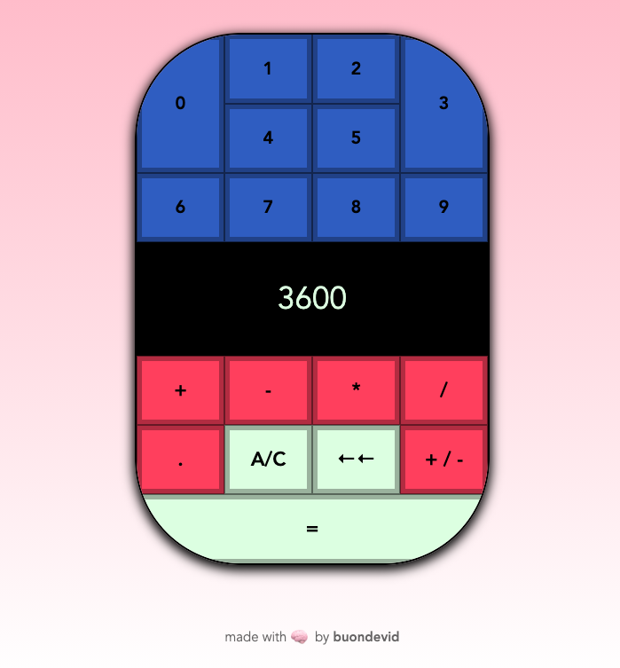

<h1 align='center'>Calculator</h1>

	

This app was created using only HTML, CSS and Vanilla JS.

This is a personal project, built to practice what I've learned on T.O.P.

It's a basic web calculator, only for real math lovers.

:link: **Live preview:** [here](https://buondevid.github.io/calculator/)

:link: **GitHub repo:** [here](https://github.com/buondevid/calculator)

## Stack & Tools  :hammer:

- HTML
- CSS
- Vanilla JS
- VS Code + ESLint
- Git & GitHub + Mac Terminal

## What I learned :book:

- Deepened my knowledge in Event Delegation.
- Approached `setTimeout()` functions together with `focus()` and `blur()`, and `click()` to cover both clicks and keyboard.
- Made use of __REGEX__ expressions to solve problems easily.
- Improved in making small reusable functions.
- Improved UX and UI, along with responsiveness.
- Made use of Grid just to pratice it, since I always rely on and prefer Flexbox.

## What could be improved :mag: 

* Study and use more RegEx since they are really useful in strings and arrays manipulation.
* Try to rely less on `if` statements.
* Practice more the mobile-first approach.

## Author

:moyai: **buondevid** --> [GitHub](https://github.com/buondevid)